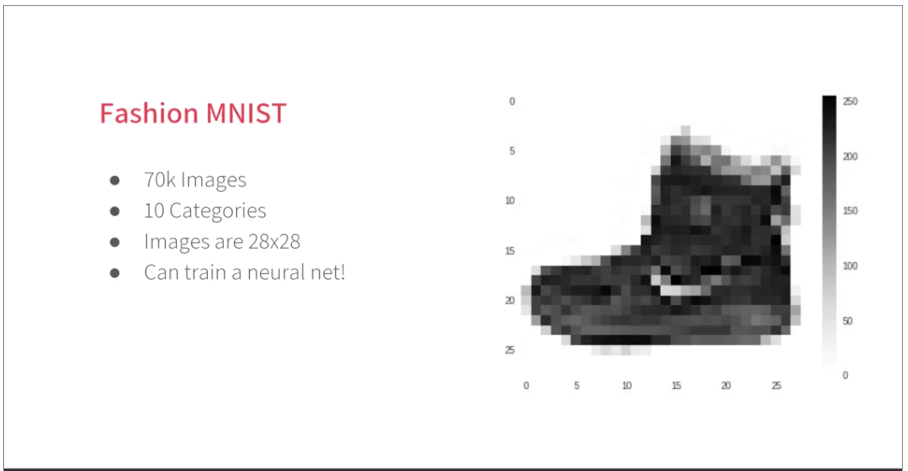

# {{ page.title }}

### _Modified National Institute of Standards and Technology_ database

It is a famous category of exercise [computer vision](computer-vision.html).

> The MNIST database (Modified National Institute of Standards and Technology database) is a large database of handwritten digits 
> that is commonly used for training various image processing systems

- [https://en.wikipedia.org/wiki/MNIST_database](https://en.wikipedia.org/wiki/MNIST_database)